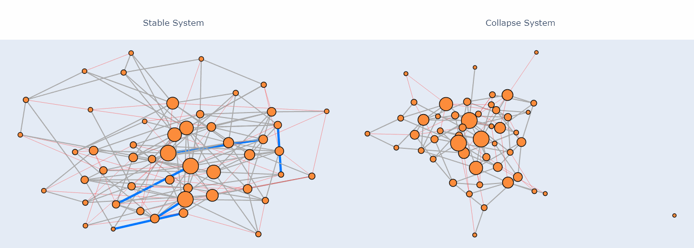

# Resonanzraum Showcase

## Why systems fail before they break

Most systems don't collapse suddenly.

They start to **erode structurally** long before anything becomes visible.

This project demonstrates a simple but powerful idea:

> The difference between stable and failing systems  
> can be detected **before failure happens**.

---

## 🔍 What this demo shows

Two scenarios illustrate how structural weakening can be detected early:

**Basic Demo** — Two network systems that look structurally identical at the start. One remains stable. One will eventually collapse. The signals diverge long before the collapse becomes visible.

**Energy Crisis (2021–2025)** — A simulated energy supply network, driven by a timeline of 22 real-world geopolitical events. Watch how supply shocks, infrastructure disruptions, and demand surges propagate through the network — and how structural signals respond before system health visibly drops.

Key signals tracked in both scenarios:

- **Structural Drift** — detects early internal change before it becomes observable
- **Early Warning** — confirms structural weakening as it accumulates
- **Stability** — the combined system state, which reacts last

Traditional monitoring reacts to the last of these. This demo shows why watching the first two matters.

---

## 🎥 Demo



---

## 🚀 Run locally

```bash
git clone https://github.com/huesnue/resonanzraum-showcase.git
cd resonanzraum-showcase

pip install -r requirements.txt
streamlit run app_demo.py
```

---

## 🧠 Key insight

At the moment where both systems still look identical on the surface:

- One system is already changing internally
- The structural erosion has already begun — just not visibly yet

This is the core idea behind the **Resonanzraum approach**:

> Structural change precedes observable failure.

The goal is not to predict *that* a system will fail.  
The goal is to detect *when it starts to fail* — invisibly.

---

## ⚙️ What's inside

This repository contains a **simplified demonstration version**:

- Lightweight network simulation (`core_lite`)
- Energy system scenario with real-world event timeline
- Network visualization with event highlighting
- Early signal tracking across time

It is designed to illustrate behavior, not to reproduce the full model.

---

## 🔒 About the model

This demo is based on the broader **Resonanzraum framework**.

The full model addresses how complex systems — financial networks, organizations, technical platforms, ecosystems — develop structural vulnerabilities over time, and how those vulnerabilities can be detected before they become visible crises.

The full model and its implementation are not part of this repository.

---

## 📌 Why this matters

In many domains, failure is detected too late:

- financial systems
- organizations
- technical platforms
- energy infrastructure
- ecosystems

This approach explores how to detect:

> **the beginning of failure — not just the result**

---

## 🧭 Next steps

This is a first public showcase.

Future work will explore:

- real-world data integration
- domain-specific applications (finance, platforms, organizations)
- extended early warning systems

---

## 📬 Contact

If you are interested in the idea, feedback or collaboration:

→ Feel free to connect via [LinkedIn](https://www.linkedin.com/in/huesnue-turkac)

---

## ⚠️ Disclaimer

This repository contains a **demonstration version**.

It is intentionally simplified and does not represent the full model or its calibration.

## License

This project is licensed under the MIT License.
